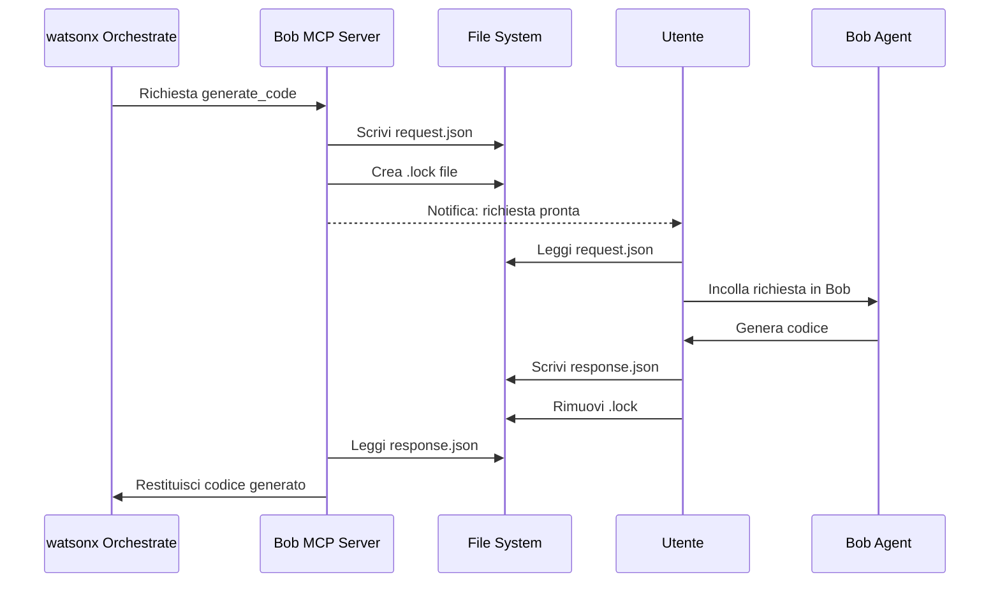

# Bob MCP Server

Server MCP (Model Context Protocol) per esporre Bob come tool in watsonx Orchestrate.

## Descrizione

Questo server MCP permette a watsonx Orchestrate di comunicare con Bob per la generazione di codice. Utilizza un sistema di comunicazione basato su file system per interfacciarsi con Bob.

## Installazione

```bash
cd bob-mcp-server
npm install
npm run build
```

## Come Funziona

Il server MCP crea una directory `bob-communication` dove scrive le richieste in formato JSON. L'utente deve:

1. Monitorare il file `bob-communication/request.json`
2. Quando appare una nuova richiesta, copiarla e incollarla in Bob
3. Salvare la risposta di Bob in `bob-communication/response.json`
4. Rimuovere il file `bob-communication/.lock`

### Struttura della Richiesta

```json
{
  "tool": "generate_code",
  "parameters": {
    "prompt": "Crea una funzione per calcolare il fattoriale",
    "language": "python",
    "context": "Usa ricorsione"
  }
}
```

### Struttura della Risposta

```json
{
  "result": "def factorial(n):\n    if n <= 1:\n        return 1\n    return n * factorial(n - 1)"
}
```

## Pubblicazione del Server MCP

Hai diverse opzioni per rendere disponibile il tuo MCP server:

### 1. **npm Registry (Pubblico o Privato)**

**npm Pubblico (gratuito):**
```bash
npm login
npm publish
```

**npm Privato (a pagamento o self-hosted):**
```bash
npm publish --registry=https://your-private-registry.com
```

**Vantaggi:**
- Facile da usare con `npx -y bob-mcp-server`
- Gestione versioni automatica
- Ampia compatibilità

### 2. **GitHub Packages**

```bash
# Configura .npmrc
echo "@your-username:registry=https://npm.pkg.github.com" > .npmrc

# Pubblica
npm publish
```

**Vantaggi:**
- Gratuito per repository pubblici
- Integrato con GitHub
- Controllo accessi tramite GitHub

### 3. **GitLab Package Registry**

```bash
npm publish --registry=https://gitlab.com/api/v4/projects/PROJECT_ID/packages/npm/
```

### 4. **Artifactory / Nexus (Enterprise)**

Per ambienti aziendali con registry privati.

### 5. **Git Repository Diretto**

Puoi usare il server direttamente da Git senza pubblicarlo:

```bash
# In watsonx Orchestrate, usa:
npx -y github:your-username/bob-mcp-server
```

**Vantaggi:**
- Non richiede pubblicazione su npm
- Controllo versioni tramite Git tags
- Gratuito

### 6. **File System Locale (Solo per test)**

```bash
# In watsonx Orchestrate, specifica il path completo:
node c:/Users/IreneDelCastello/Desktop/Project Bob/bob-mcp-server/dist/index.js
```

## Configurazione in watsonx Orchestrate

### Opzione 1: Connessione Locale (Sviluppo)

1. Apri watsonx Orchestrate
2. Vai su **Integrations** → **MCP Servers** → **Add Local Server**
3. Configura:
   - **Name**: Bob Code Generator
   - **Command**: `node`
   - **Args**: `c:/Users/IreneDelCastello/Desktop/Project Bob/bob-mcp-server/dist/index.js`

### Opzione 2: Da npm (Produzione)

Dopo aver pubblicato su npm:

1. In watsonx Orchestrate:
   - **Name**: Bob Code Generator
   - **Command**: `npx`
   - **Args**: `-y bob-mcp-server@latest`

### Opzione 3: Da GitHub (Senza npm)

1. Pusha il codice su GitHub
2. In watsonx Orchestrate:
   - **Name**: Bob Code Generator
   - **Command**: `npx`
   - **Args**: `-y github:your-username/bob-mcp-server`

## Tool Disponibili

### generate_code

Genera codice basato su una descrizione.

**Parametri:**
- `prompt` (required): Descrizione del codice da generare
- `language` (optional): Linguaggio di programmazione (python, javascript, typescript, java, go, rust)
- `context` (optional): Contesto aggiuntivo o requisiti specifici

**Esempio di utilizzo in watsonx Orchestrate:**

```
Genera una funzione Python per calcolare i numeri di Fibonacci usando la ricorsione
```

## Workflow di Comunicazione



## Sviluppo

### Build

```bash
npm run build
```

### Modalità Watch

```bash
npm run watch
```

### Test Locale

```bash
npm start
```

## Raccomandazioni per la Pubblicazione

**Per uso personale/test:**
- Usa **file system locale** o **GitHub diretto**

**Per team interno:**
- Usa **GitHub Packages** o **GitLab Package Registry**

**Per uso pubblico:**
- Pubblica su **npm pubblico**

**Per ambiente enterprise:**
- Usa **Artifactory** o **Nexus** con registry privato

## Limitazioni

- Richiede intervento manuale per ogni richiesta
- Timeout di 5 minuti per richiesta
- Non supporta streaming in tempo reale

## Miglioramenti Futuri

- [ ] Automazione tramite VS Code Extension API
- [ ] Supporto per più tool (explain_code, refactor_code, debug_code)
- [ ] Cache delle risposte
- [ ] Logging avanzato
- [ ] Supporto per file multipli

## Licenza

MIT